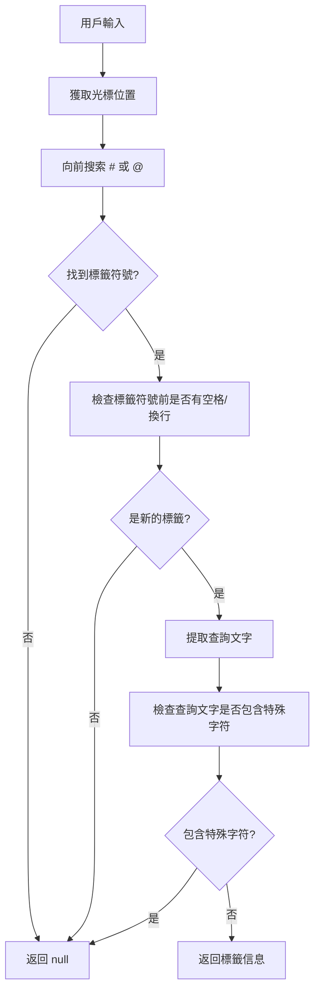
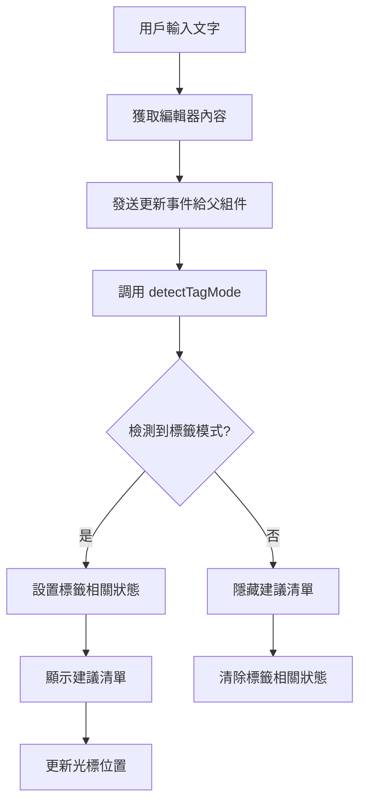
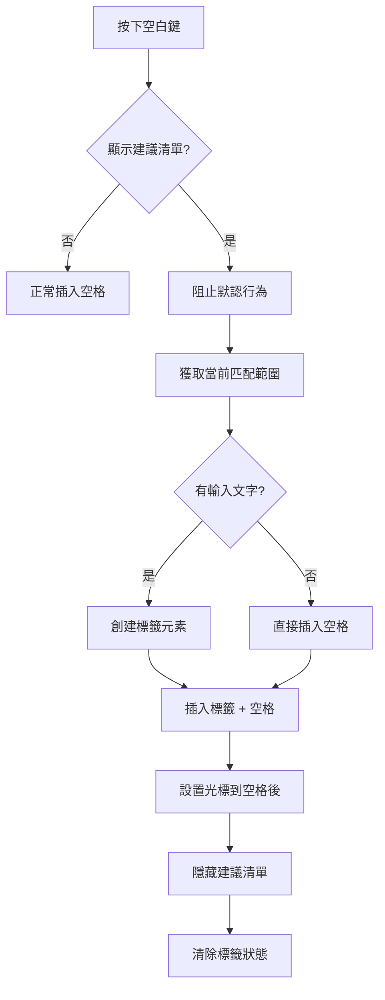
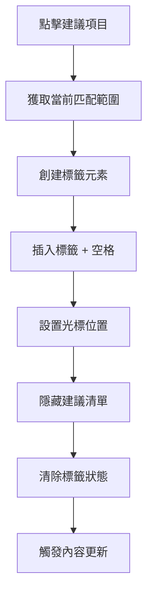
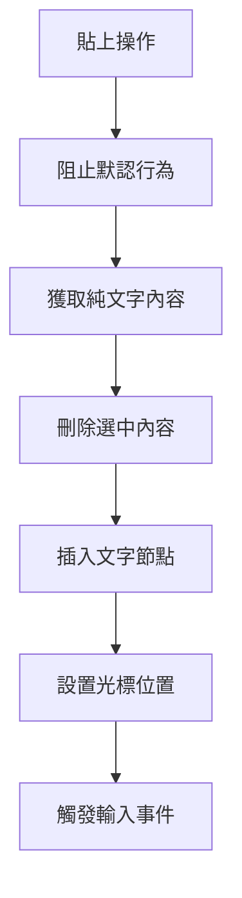
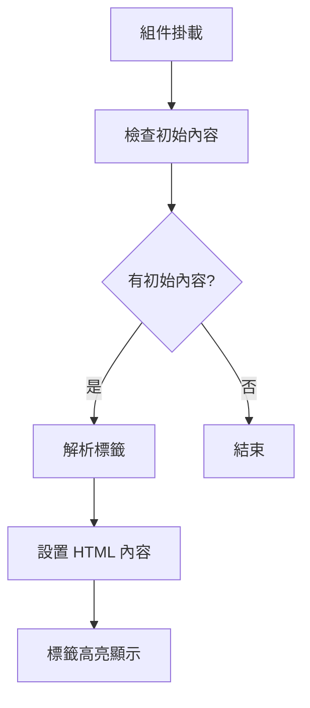

# Post Content 組件說明文件

## 📋 組件概述

`post-postContent.vue` 是一個基於 `contenteditable` 的富文本編輯器組件，實現了類似 Instagram 的標籤和提及功能。支援 `#` 標籤和 `@` 提及的自動完成建議。

## 🏗️ 組件架構

### 核心功能
- **富文本編輯**：使用 `contenteditable` 實現可編輯區域
- **標籤系統**：支援 `#` 標籤自動完成
- **提及系統**：支援 `@` 用戶提及自動完成
- **鍵盤導航**：支援空白鍵、Enter 鍵等快捷操作
- **視覺化標籤**：標籤以藍色高亮顯示

## 🔧 技術實現

### 1. 組件結構

```vue
<template>
  <view class="editor-wrapper">
    <!-- 發文輸入區 - 使用 contenteditable 實現類似 Instagram 的編輯器 -->
    <view class="editor" contenteditable="true" 
          @input="handleInput" 
          @keyup="handleKeyup" 
          @keydown="handleKeydown"
          @paste="handlePaste" 
          ref="editorRef"
          :aria-label="$t('common.postContent')" 
          role="textbox" 
          spellcheck="true"
          tabindex="0" 
          :aria-placeholder="$t('common.postContent')">
    </view>
    
    <!-- 建議清單面板 -->
    <view class="suggestion-panel" v-show="showSuggestions" :style="panelStyle">
      <view class="suggestion-item" v-for="user in filteredSuggestions" :key="user.id"
            @click="selectSuggestion(user.name)">
        {{ user.name }}
      </view>
    </view>
  </view>
</template>
```

### 2. 響應式數據

```typescript
// 編輯器 DOM 節點參考
const editorRef = ref<HTMLElement>();

// 控制建議清單顯示狀態
const showSuggestions = ref(false);

// 使用者輸入 @ 或 # 後的關鍵字
const mentionQuery = ref('');

// 當前標籤類型 (# 或 @)
const currentTagType = ref<'#' | '@' | null>(null);

// caret 光標座標位置，用於彈窗定位
const caretCoords = reactive({ top: 0, left: 0 });

// 當前匹配的範圍
const currentMatchRange = ref<{ start: number; end: number } | null>(null);

// 模擬建議資料
const suggestions = [
  { id: 1, name: '小帥' },
  { id: 2, name: 'Vue粉絲團' },
  { id: 3, name: 'uniApp高手' },
  { id: 4, name: 'React開發者' },
  { id: 5, name: 'JavaScript大師' },
];

// 根據目前輸入文字篩選建議清單
const filteredSuggestions = computed(() => {
  if (!mentionQuery.value) return suggestions;
  return suggestions.filter(u =>
    u.name.toLowerCase().includes(mentionQuery.value.toLowerCase())
  );
});

// 控制建議清單的樣式位置
const panelStyle = computed(() => {
  // 簡化定位，避免複雜的 DOM 計算
  return `position: absolute; top: 100%; left: 0px; z-index: 1000;`;
});
```

## 🔄 核心邏輯流程

### 0. 輔助函數

#### DOM 元素獲取 (`getEditorEl`)
```typescript
const getEditorEl = (): HTMLElement | null => {
  if (!editorRef.value) return null;
  
  // 在 uni-app 環境中，可能需要通過 $el 獲取實際的 DOM 元素
  const element = (editorRef.value as any).$el || editorRef.value;
  
  // 確保是有效的 DOM 元素
  if (element && typeof element.getBoundingClientRect === 'function') {
    return element;
  }
  
  return null;
};
```

#### 光標位置計算 (`getCaretPosition`)
```typescript
const getCaretPosition = () => {
  const sel = window.getSelection();
  if (!sel || sel.rangeCount === 0) return null;

  const range = sel.getRangeAt(0);
  const rect = range.getBoundingClientRect();
  const editor = getEditorEl();

  if (!editor || typeof editor.getBoundingClientRect !== 'function') return null;

  const editorRect = editor.getBoundingClientRect();
  return {
    top: rect.bottom - editorRect.top + (editor.scrollTop || 0),
    left: rect.left - editorRect.left + (editor.scrollLeft || 0)
  };
};
```

#### 更新光標位置 (`updateCaretPosition`)
```typescript
const updateCaretPosition = () => {
  // 在 uni-app 環境中簡化光標位置計算
  // 使用固定的相對定位，避免複雜的 DOM 計算
  caretCoords.top = 0;
  caretCoords.left = 0;
};
```

**實現細節：**
- 在 uni-app 環境中簡化光標位置計算
- 使用固定的相對定位，避免複雜的 DOM 計算
- 將光標座標設置為 (0, 0)，建議清單使用相對定位顯示

### 1. 標籤檢測流程 (`detectTagMode`)



**實現細節：**
- 從光標位置向前搜索 `#` 或 `@` 符號
- 確保標籤符號前有空格或換行（新標籤的標識）
- 允許中文字符、英文字母、數字和下劃線
- 遇到空格或特殊字符時結束標籤模式

### 2. 輸入處理流程 (`handleInput`)



### 3. 鍵盤事件處理

#### 空白鍵處理 (`handleKeydown` - 空白鍵邏輯)



**關鍵實現：**
- 當在標籤模式時按下空白鍵，自動完成當前標籤
- 如果有輸入文字（`tagContent.length > 1`），創建帶樣式的標籤元素：
  ```typescript
  const tagSpan = document.createElement('span');
  tagSpan.className = 'hashtag';
  tagSpan.textContent = tagContent;
  ```
- 如果只是 `#` 或 `@`，直接插入空格：
  ```typescript
  textNode.textContent = before + ' ' + after;
  ```
- 光標定位到空格後面，準備輸入下一個標籤
- 隱藏建議清單並清除所有標籤相關狀態

#### 其他鍵盤事件
- **Enter 鍵**：可實現鍵盤導航功能（待擴展）
- **上下箭頭**：可實現建議清單導航（待擴展）

### 4. 建議清單選擇流程 (`selectSuggestion`)



### 5. 貼上事件處理 (`handlePaste`)



**實現細節：**
- 阻止瀏覽器默認的貼上行為
- 只保留純文字內容，過濾 HTML 標籤
- 正確設置光標位置到貼上內容後面
- 觸發輸入事件以檢測新的標籤模式

### 6. 內容初始化 (`setContentWithTags`)



**實現細節：**
- 在組件掛載後檢查是否有初始內容
- 使用正則表達式解析 `#` 和 `@` 標籤：
  - `/(#\w+)/g` - 匹配 `#` 開頭的英文標籤
  - `/(@\w+)/g` - 匹配 `@` 開頭的英文標籤
- 將標籤包裝在 `<span class="hashtag">` 中
- 確保標籤以藍色高亮顯示

**注意：** 目前的正則表達式只支援英文字符，如需支援中文標籤，需要修改為：
```typescript
const html = content
  .replace(/(#[^\s]+)/g, '<span class="hashtag">$1</span>')
  .replace(/(@[^\s]+)/g, '<span class="hashtag">$1</span>');
```

## 🎨 樣式實現

### 標籤樣式
```scss
:deep(.hashtag) {
  color: #0868aa;        // 藍色高亮
  font-weight: bold;     // 粗體
  text-decoration: none; // 無下劃線
}
```

### 建議清單樣式
```scss
.suggestion-panel {
  background-color: #fff;
  border: 1px solid #ddd;
  border-radius: 8rpx;
  box-shadow: 0 4rpx 10rpx rgba(0, 0, 0, 0.1);
  z-index: 1000;
  max-height: 200rpx;
  overflow-y: auto;
}
```

## 🔌 組件接口

### Props
```typescript
interface Props {
  modelValue?: string; // 雙向綁定的文字內容
}
```

### Events
```typescript
interface Emits {
  'update:modelValue': [value: string]; // 內容更新事件
}
```

### 暴露方法
```typescript
interface ExposedMethods {
  insertText: (text: string) => void; // 插入文字方法
}

// 實際暴露的方法
defineExpose({ insertText });
```

## 📝 使用範例

### 基本使用
```vue
<template>
  <post-postContent 
    v-model="postContent" 
    @update:modelValue="handleTextChange" 
  />
</template>

<script setup>
const postContent = ref('');

const handleTextChange = (newContent) => {
  console.log('內容更新:', newContent);
};
</script>
```

### 程式化插入標籤
```vue
<template>
  <post-postContent ref="contentRef" v-model="postContent" />
  <button @click="addHashTag">添加標籤</button>
  <button @click="addMention">添加提及</button>
</template>

<script setup>
const contentRef = ref();

const addHashTag = () => {
  contentRef.value.insertText(' #');
};

const addMention = () => {
  contentRef.value.insertText(' @');
};
</script>
```

## 🚀 功能特色

### 1. 智能標籤檢測
- 自動識別 `#` 和 `@` 符號
- 支援中英文混合標籤
- 智能邊界檢測

### 2. 實時建議
- 根據輸入內容即時篩選建議
- 支援模糊匹配
- 可擴展的建議數據源

### 3. 鍵盤友好
- 空白鍵快速完成標籤
- 支援鍵盤導航（可擴展）
- 流暢的編輯體驗

### 4. 視覺化標籤
- 標籤自動高亮顯示
- 保持編輯器結構完整
- 支援複製貼上

## 🔮 擴展建議

### 1. 鍵盤導航
```typescript
// 可擴展的鍵盤導航功能
const handleKeydown = (e: KeyboardEvent) => {
  if (showSuggestions.value) {
    switch (e.key) {
      case 'ArrowDown':
        // 向下選擇建議
        break;
      case 'ArrowUp':
        // 向上選擇建議
        break;
      case 'Enter':
        // 選擇當前建議
        break;
      case 'Escape':
        // 關閉建議清單
        break;
    }
  }
};
```

### 2. API 集成
```typescript
// 可替換的建議數據源
const fetchSuggestions = async (query: string, type: '#' | '@') => {
  if (type === '#') {
    return await api.getHashtags(query);
  } else {
    return await api.getUsers(query);
  }
};
```

### 3. 自定義樣式
```scss
// 可配置的標籤樣式
:deep(.hashtag) {
  color: var(--tag-color, #0868aa);
  font-weight: var(--tag-weight, bold);
  background: var(--tag-bg, transparent);
  padding: var(--tag-padding, 0);
  border-radius: var(--tag-radius, 0);
}
```

## 🐛 已知限制

1. **光標定位**：在 uni-app 環境中，光標位置計算可能不夠精確
2. **跨平台兼容**：某些 DOM 操作在不同平台可能有差異
3. **性能優化**：大量文字時可能需要虛擬化處理
4. **無障礙支持**：可進一步改善鍵盤導航和屏幕閱讀器支持

## 📚 相關文件

- [Vue 3 Composition API](https://vuejs.org/guide/composition-api/)
- [ContentEditable API](https://developer.mozilla.org/en-US/docs/Web/HTML/Global_attributes/contenteditable)
- [Selection API](https://developer.mozilla.org/en-US/docs/Web/API/Selection)
- [Range API](https://developer.mozilla.org/en-US/docs/Web/API/Range)
